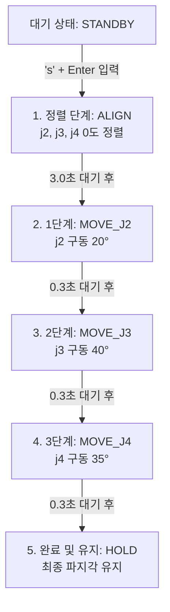

# 🦾 [KITECH] 3축 실시간 제어 및 손가락 순차 구동 가이드

이 문서는 **PEAK-USB CAN 통신 설정**부터 **3축 실시간 드라이버 구동**, 그리고 **j2, j3, j4 관절의 순차 구동 시퀀스(각각 20°, 40°, 35°)**를 제어하기 위한 전체 가이드라인입니다. Notion에 바로 붙여넣어 사용하실 수 있도록 작성되었습니다.

---

## 🛠️ [Step 1] 하드웨어 결선 및 CAN 버퍼 확장
> **PEAK-USB 장치를 PC에 연결하고, CAN 드라이버를 로드한 뒤 실시간 제어에 적합하도록 전송 버퍼(txqueuelen) 용량을 확장합니다.**

```bash
# 1. CAN 커널 모듈(드라이버) 로드
sudo modprobe peak_usb

# 2. CAN 인터페이스 비활성화 (설정 변경을 위해)
sudo ip link set can0 down

# 3. 송신 큐(Buffer Size) 용량을 1000으로 늘려 패킷 유실 방지
sudo ip link set can0 txqueuelen 1000

# 4. CAN 통신 속도를 1,000,000 bps (1 Mbps)로 구성
sudo ip link set can0 type can bitrate 1000000

# 5. CAN 인터페이스 활성화
sudo ip link set can0 up
```

---

## 🖥️ [Step 2] 3축 실시간 제어 드라이버 구동 (터미널 1)
> **하드웨어 제어 루프와 ROS 2 토픽 통신을 중개하는 메인 드라이버 노드를 실행합니다.**

1. 새 터미널을 열고 아래 명령어를 실행합니다.
```bash
# ROS 2 험블 환경 초기화
source /opt/ros/humble/setup.bash

# 작업 디렉터리로 이동
cd ~/Documents/양태헌교수님학연생/arm_lab_control/real_driver

# 드라이버 구동
python3 real_welcon_driver.py
```

---

## 🖐️ [Step 3] 손가락 굽힘 동작 구동 (터미널 2)
> **정렬(ALIGN) 수행 후 j2, j3, j4 관절을 순차적으로 구동하는 시퀀스 컨트롤러 노드를 실행합니다.**

1. 또 다른 새 터미널을 열고 아래 명령어를 실행합니다.
```bash
# ROS 2 험블 환경 초기화
source /opt/ros/humble/setup.bash

# 작업 디렉터리로 이동
cd ~/Documents/양태헌교수님학연생/arm_lab_control/real_driver

# 시퀀스 제어 스크립트 실행
python3 finger_bend_sequence.py
```

> 💡 **사용 가능한 키 입력 인터페이스:**
> * `s` 키 + `Enter`: 정렬 및 20° ➡️ 40° ➡️ 35° 순차 구동 시퀀스 시작
> * `r` 키 + `Enter`: 전체 상태 초기화 및 대기(STANDBY) 상태로 복귀
> * `q` 키 + `Enter`: 안전 종료 (모든 관절 인가 전압 즉시 0 mV 차단)

---

## 🔍 핵심 코드 설명: 정렬 후 20°, 40°, 35° 순차 구동
[finger_bend_sequence.py](file:///home/bumsu/Documents/양태헌교수님학연생/arm_lab_control/real_driver/finger_bend_sequence.py) 내부 상태 기기(State Machine)의 구동 메커니즘 설명입니다. 

### 1. 상태 전이 및 목표 각도 제어 흐름


### 2. 관절별 제어 목표값 상세
손가락이 굽혀지는 방향(Flexion)을 직관적으로 **양수(+) 각도**로 매핑하였습니다.
* **j2 관절**: 정렬 기준점(`0.0°`)에서 20도 굽힘 동작을 수행해 **`20.0°`**에 도달합니다.
* **j3 관절**: 정렬 기준점(`0.0°`)에서 40도 굽힘 동작을 수행해 **`40.0°`**에 도달합니다.
* **j4 관절**: 정렬 기준점(`0.0°`)에서 35도 굽힘 동작을 수행해 **`35.0°`**에 도달합니다.

### 3. 상태 기기 구현 코드 ([finger_bend_sequence.py#L177-L217](file:///home/bumsu/Documents/양태헌교수님학연생/arm_lab_control/real_driver/finger_bend_sequence.py#L177-L217))

```python
        # ----------------------------------------------------------------------
        # [🔄 시퀀스 제어 상태기기 (State Machine)]
        # ----------------------------------------------------------------------
        elapsed_time = time.monotonic() - self.state_start_time

        if self.current_state == "ALIGN":
            # j2, j3, j4 모두 0도 정렬 (ALIGN 위치)
            self.update_target_degree('j2', 0.0)
            self.update_target_degree('j3', 0.0)
            self.update_target_degree('j4', 0.0)
            if elapsed_time > 3.0:
                self.current_state = "MOVE_J2"
                self.state_start_time = time.monotonic()
                self.get_logger().info("➡️ [1단계] 조인트 2 구동 시작 (0° ➡️ 20°)")

        elif self.current_state == "MOVE_J2":
            self.update_target_degree('j2', 20.0)
            self.update_target_degree('j3', 0.0)
            self.update_target_degree('j4', 0.0)
            if elapsed_time > 0.3:
                self.current_state = "MOVE_J3"
                self.state_start_time = time.monotonic()
                self.get_logger().info("➡️ [2단계] 조인트 3 구동 시작 (0° ➡️ 40°)")

        elif self.current_state == "MOVE_J3":
            self.update_target_degree('j2', 20.0)
            self.update_target_degree('j3', 40.0)
            self.update_target_degree('j4', 0.0)
            if elapsed_time > 0.3:
                self.current_state = "MOVE_J4"
                self.state_start_time = time.monotonic()
                self.get_logger().info("➡️ [3단계] 조인트 4 구동 시작 (0° ➡️ 35°)")

        elif self.current_state == "MOVE_J4":
            self.update_target_degree('j2', 20.0)
            self.update_target_degree('j3', 40.0)
            self.update_target_degree('j4', 35.0)
            if elapsed_time > 0.3:
                self.current_state = "HOLD"
                self.get_logger().info("✅ [시퀀스 완료] j2=20°, j3=40°, j4=35° 파지 포즈 수렴 완료.")

        elif self.current_state == "HOLD":
            self.update_target_degree('j2', 20.0)
            self.update_target_degree('j3', 40.0)
            self.update_target_degree('j4', 35.0)
```

---

## ⚡ 뻑뻑한 조인트 3번(j3)을 위한 물리 보상 설정
> **조인트 3번(Node 1)이 기계적으로 뻑뻑하여 정렬 및 목표 각도 도달이 실패하는 문제를 개선하기 위해 다음 보상 파라미터가 개별 설정되었습니다.**

### 1. 개별 게인 테이블 (`self.GAIN_CONFIG`)
```python
self.GAIN_CONFIG = {
    'j1': {'Kp': 350.0, 'Kd': 15.0, 'Ki': 0.5, 'Ki_limit': 500.0, 'DEADZONE_DEG': 3.0, 'FRICT_COMP': 800.0},
    'j2': {'Kp': 350.0, 'Kd': 15.0, 'Ki': 0.5, 'Ki_limit': 500.0, 'DEADZONE_DEG': 3.0, 'FRICT_COMP': 1000.0},
    'j3': {'Kp': 450.0, 'Kd': 15.0, 'Ki': 1.5, 'Ki_limit': 800.0, 'DEADZONE_DEG': 1.5, 'FRICT_COMP': 1200.0}, # 뻑뻑함 보상 세팅
    'j4': {'Kp': 350.0, 'Kd': 15.0, 'Ki': 0.5, 'Ki_limit': 500.0, 'DEADZONE_DEG': 3.0, 'FRICT_COMP': 1000.0}
}
```

* **게인 상향 (`Kp=450`, `Ki=1.5`)**: 뻑뻑한 관절을 강하게 제어하기 위해 비례 및 오차 적분 게인을 높여 모터의 수렴력을 증대했습니다.
* **정마찰 보상 (`FRICT_COMP`)**: 미세한 오차가 남아있을 때 모터가 구동될 수 있는 **최소 시동 오프셋 전압**을 각 조인트 특성에 맞춰 상시 인가해 마찰력을 깨트립니다.
* **불감대 내 백래시 보상 (Stiction Tail 제어)**: 오차가 불감대(Deadzone) 이내로 들어와도 즉시 전압을 차단하지 않고, **기어 유격(Backlash)을 이겨내고 기어가 반대편에 완전히 물리도록 이동 방향으로 정마찰 전압의 80%를 부하 전압으로 부가**하여 확실히 밀착시킵니다.
* **정렬 대기 시간 연장**: 정렬 단계(`ALIGN`)의 제한 시간을 기존 **`1.0초`에서 `3.0초`로 연장**하여 마찰력을 극복하며 천천히 수렴할 수 있는 시간을 확보했습니다.

---

> ℹ️ **참고 사항 (조인트 매핑 정보):**
> * **j1**: Node ID 3, Axis 1 (ALIGN: -214.0 count, FLEX: 806.0 count)
> * **j2**: Node ID 2, Axis 1 (ALIGN: -1008.0 count, FLEX: -655.0 count)
> * **j3**: Node ID 1, Axis 1 (ALIGN: 596.0 count, FLEX: 1651.0 count)
> * **j4**: Node ID 3, Axis 2 (ALIGN: -388.0 count, FLEX: 664.0 count)
